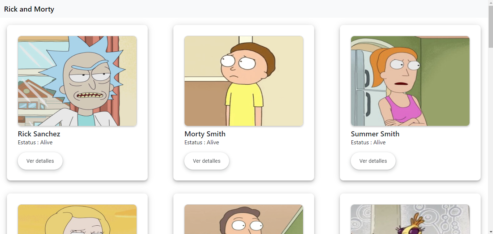
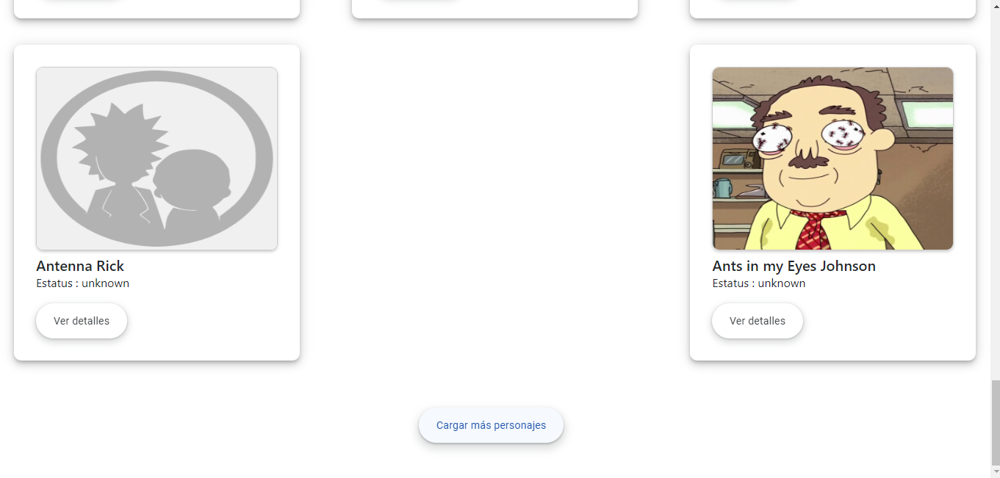
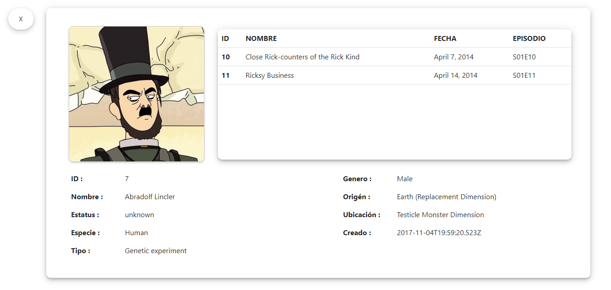
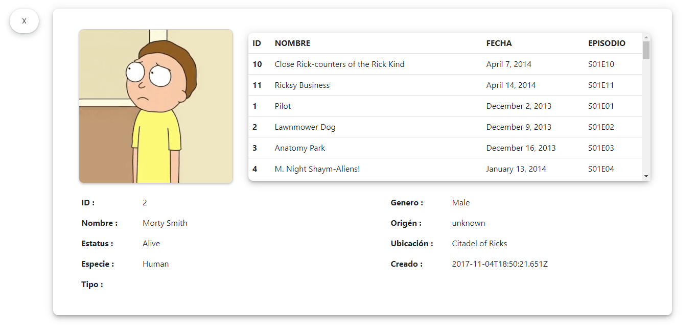

# ApiAngularRickandmorty

This project was generated with [Angular CLI](https://github.com/angular/angular-cli) version 16.1.4.

## Development server

Run `ng serve` for a dev server. Navigate to `http://localhost:4200/`. The application will automatically reload if you change any of the source files.

## Api de Rick and Morty

Documentación de la [api](https://rickandmortyapi.com/) .

## Imagenes

